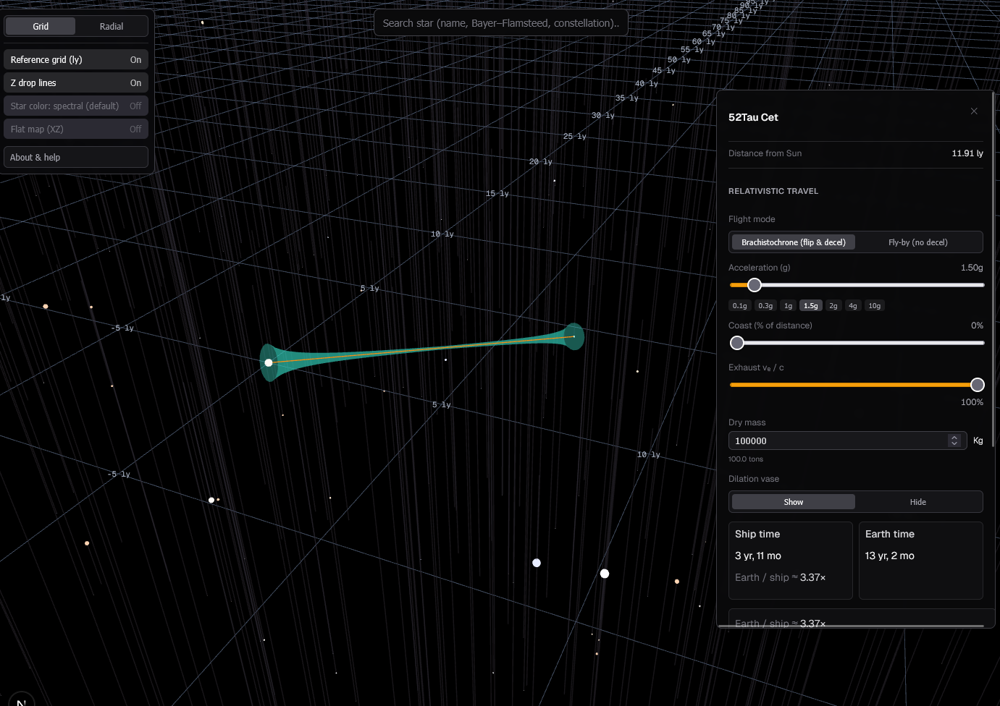
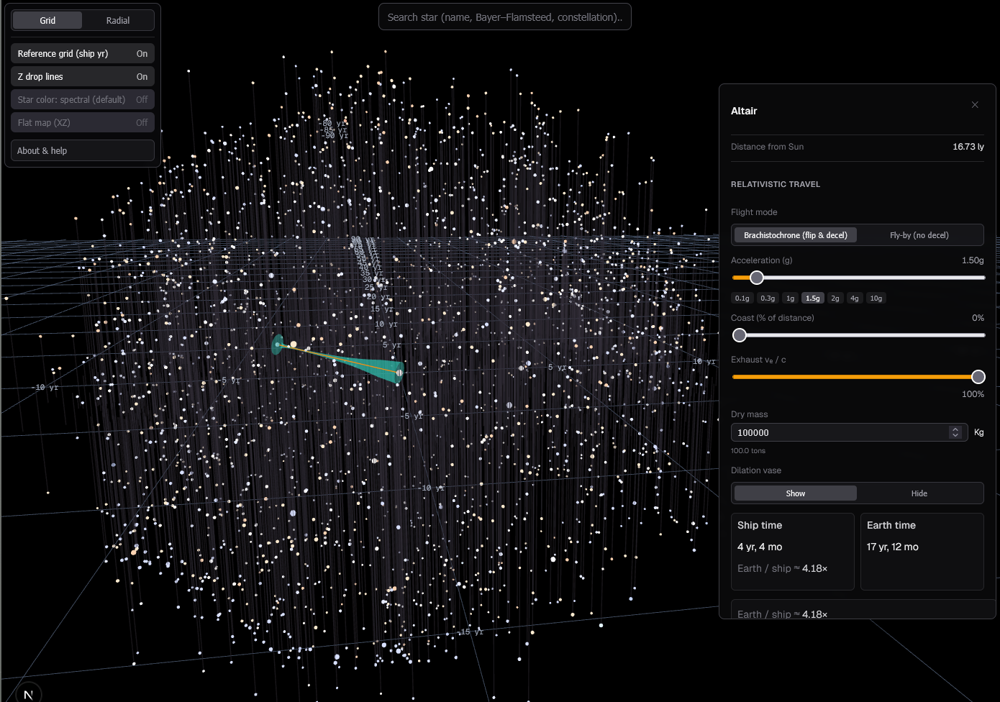
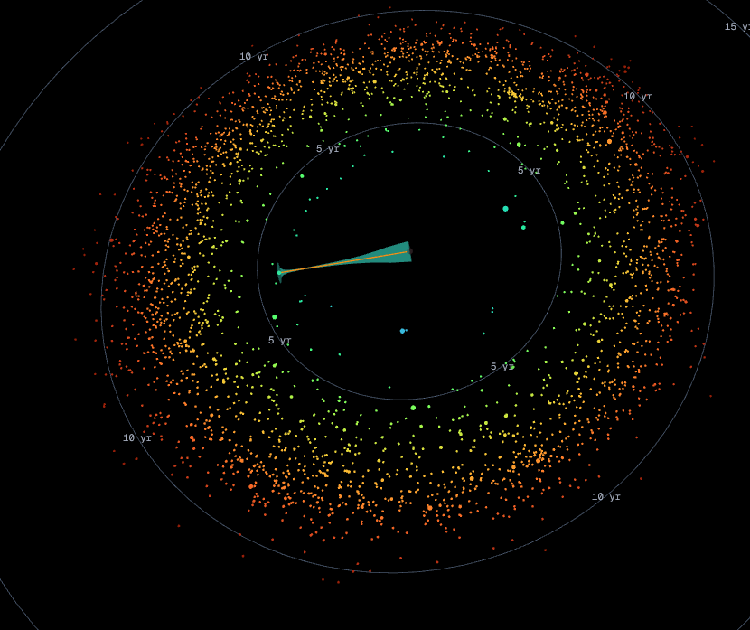

# Interstellar Map

Interactive 3D map of nearby stars using the [HYG Database](https://www.astronexus.com/projects/hyg), shown in a Cartesian frame with axes in light-years. Built with [Next.js](https://nextjs.org), [React Three Fiber](https://docs.pmnd.rs/react-three-fiber), and [Three.js](https://threejs.org). All functions and calculations are based on The Overview Effect's relativistic travel calculator. Star positions are from the HYG catalog, though filtered to only include stars with names. I made this just after watching Project Hail Mary; Can't sleep.

Amaze Amaze Amaze.





## Features

- HYG star catalog (filtered CSV) rendered as an instanced point field
- Pan, zoom, and fly through the solar neighborhood
- HUD with search, coordinate readout, and links to data sources
- Optional relativistic travel-time panel (ship time vs Earth time)

## Requirements

- Node.js 20+ (22 recommended; matches CI)

## Local development

```bash
npm install
npm run dev
```

Open [http://localhost:3000](http://localhost:3000). For local dev, leave `NEXT_PUBLIC_BASE_PATH` unset so the app is served from the site root.

## Production build

The app is configured for **static export** (`output: "export"`). The production bundle is written to `out/`.

```bash
npm run build
```

To mimic GitHub Pages (project site under `https://<user>.github.io/<repo>/`), set the same base path you use on GitHub:

```bash
# PowerShell
$env:NEXT_PUBLIC_BASE_PATH="/your-repo-name"; npm run build

# bash
NEXT_PUBLIC_BASE_PATH=/your-repo-name npm run build
```

Preview the export locally (optional):

```bash
npx serve out
```

## Deploy to GitHub Pages

This repo includes a workflow that builds on every push to `main` or `master` and publishes with [GitHub Actions](https://docs.github.com/en/pages/getting-started-with-github-pages/configuring-a-publishing-source-for-your-github-pages-site#publishing-with-a-custom-github-actions-workflow).

1. Push this repository to GitHub (the **repository name** becomes the URL path segment, e.g. `https://<user>.github.io/interstellarmap/`).
2. In the repo on GitHub: **Settings → Pages**.
3. Under **Build and deployment**, set **Source** to **GitHub Actions**.
4. Run the workflow once (push to `main`/`master`, or **Actions → Deploy to GitHub Pages → Run workflow**).

The workflow sets `NEXT_PUBLIC_BASE_PATH` to `/<repository-name>` so routes and the HYG CSV load correctly on a project site.

### Custom domain or user/org site at the domain root

If you publish at the root of `username.github.io` (no repo prefix) or use a custom domain without a subpath, you need an empty base path: change or remove the `NEXT_PUBLIC_BASE_PATH` line in [`.github/workflows/deploy-github-pages.yml`](.github/workflows/deploy-github-pages.yml) for your setup, or set it to `""` in that job’s `env` block.

### Jekyll and `_next`

A [`.nojekyll`](public/.nojekyll) file in `public/` is copied into `out/` so GitHub Pages does not ignore Next’s `_next` assets.

## Data

- `public/hyg_v42_filtered.csv` — star catalog used at runtime  
- `public/hyg_expl.txt` — pointer to HYG documentation

## License

Star data is subject to the HYG Database terms; see [HYG](https://www.astronexus.com/projects/hyg) for attribution and usage.
